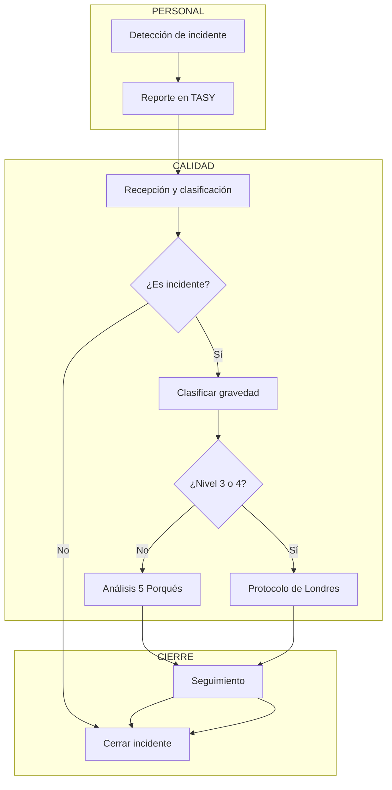

# PO-CSP-1267 - Registro y Gestión de Eventos

## Flujo del proceso de incidentes

```mermaid
graph TB
    subgraph "PERSONAL"
        P1[Detección de incidente]
        P2[Reporte en TASY]
    end

    subgraph "CALIDAD"
        Q1[Recepción y clasificación]
        Q2{¿Es incidente?}
        Q3[Clasificar gravedad]
        Q4{¿Nivel 3 o 4?}
        Q5[Análisis 5 Porqués]
        Q6[Protocolo de Londres]
    end

    subgraph "CIERRE"
        C1[Seguimiento]
        C2[Cerrar incidente]
    end

    P1 --> P2 --> Q1 --> Q2
    Q2 -->|No| C2
    Q2 -->|Sí| Q3 --> Q4
    Q4 -->|No| Q5 --> C1 --> C2
    Q4 -->|Sí| Q6 --> C1 --> C2
```
